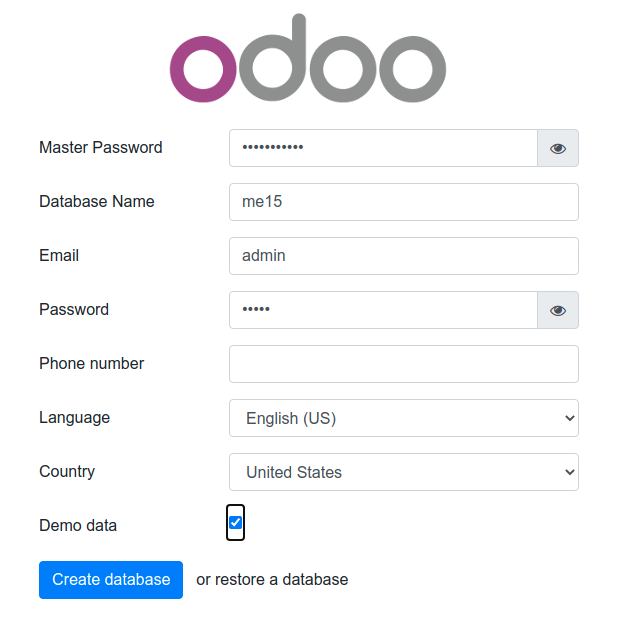
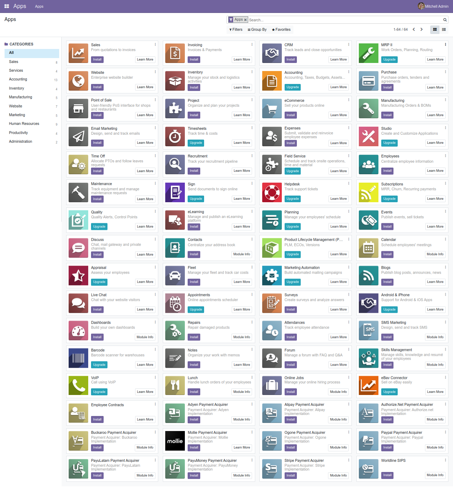
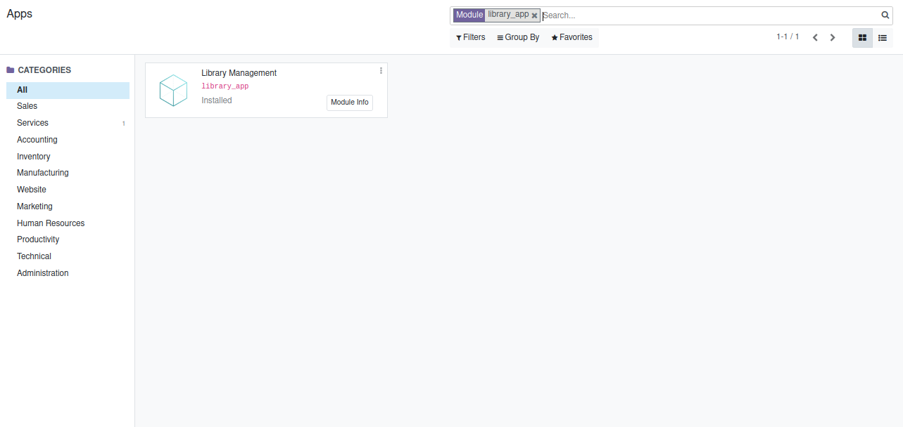
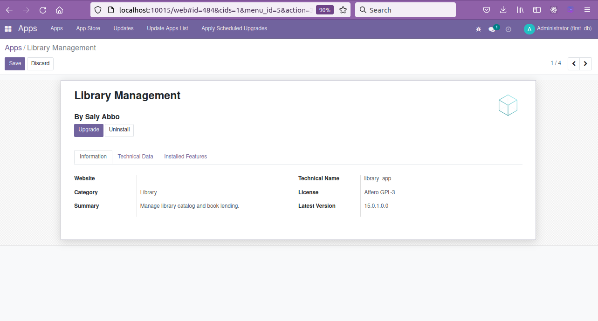

# Quick install

Installing and run Odoo 15 with one command.


# Usage

Start and build the container:
``` sh
docker-compose up --build
```

* Then open `localhost:10015` to access Odoo 15.0. If you want to start the server with a different port, change **10015** to another value in **docker-compose.yml**:

```
ports:
 - "10015:8069"
```

Run Odoo container in detached mode (be able to close terminal without stopping Odoo):

```
docker-compose up -d
```


# Custom addons

The **addons/** folder contains custom addons. Just put your custom addons if you have any.

# Odoo container management

**Run Odoo**:

``` bash
docker-compose up -d
```

**Restart Odoo**:

``` bash
docker-compose restart
```

**Stop Odoo**:

``` bash
docker-compose down
```


# docker-compose.yml

* odoo:15.0
* postgres:14

# Odoo 15 screenshots








